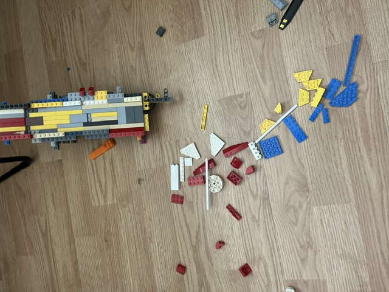
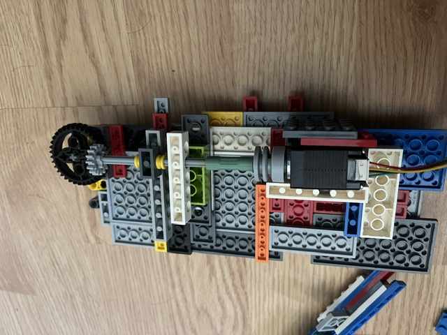
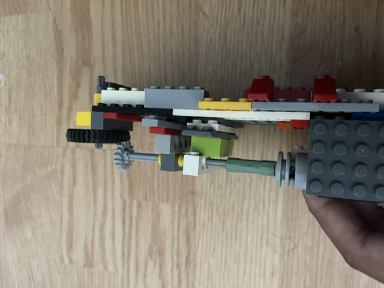
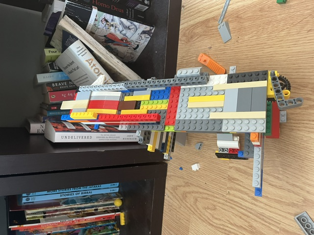

## Mechanical Subsystems & Iterations

### 1. Prototype Development (v1.0)

* **Description:** Early-stage testing of the Lego gravity track geometry, sorting channel alignment, and loose brick feed mechanism to evaluate brick motion before integrating optical sensors.

---

### 2. Deflector Gate Drivetrain
| Top View (Motor Coupling) | Side View (90° Gear Train) |
| :---: | :---: |
|  |  |
| *Direct motor-to-axle coupling feeding into a Technic support superstructure.* | *Profile view showing right-angle gear mesh for driving the sorting deflector gate.* |

## Substructure Evolution & Stability (v2.0)

### Problem: Track Flex & Unstable Geometry
In the initial prototype (v1.0), using a simple flat track without a rigid frame resulted in torsional flex across long spans. This instability made it difficult to maintain consistent alignment for the motor drive and sorting channel.

---

### Solution: Structural Under-Framing & Passive Tilting
The assembly was upgraded with a heavy Technic support framework underneath to create a rigid chassis before mounting electronic sensors.

| Early Prototype (v1.0 Flat Ramp) | Iteration 2 (v2.0 Reinforced Frame) |
| :---: | :---: |
|  |  |
| *Minimal flat track built to test basic gravity slide.* | *Added heavy Technic under-framing for chassis stability and rigidity.* |

---

### Key Structural Improvements

1. **Chassis Rigidity:** Multi-layer Technic support prevents the frame from twisting or sagging when the gate motor operates.
2. **Passive Alignment:** Built-in track tilt uses gravity to guide bricks along the lower wall while keeping the top completely open for larger pieces.
3. **Modular Foundation:** Establishes a rigid base to support future sensor mounting and drive alignment.
